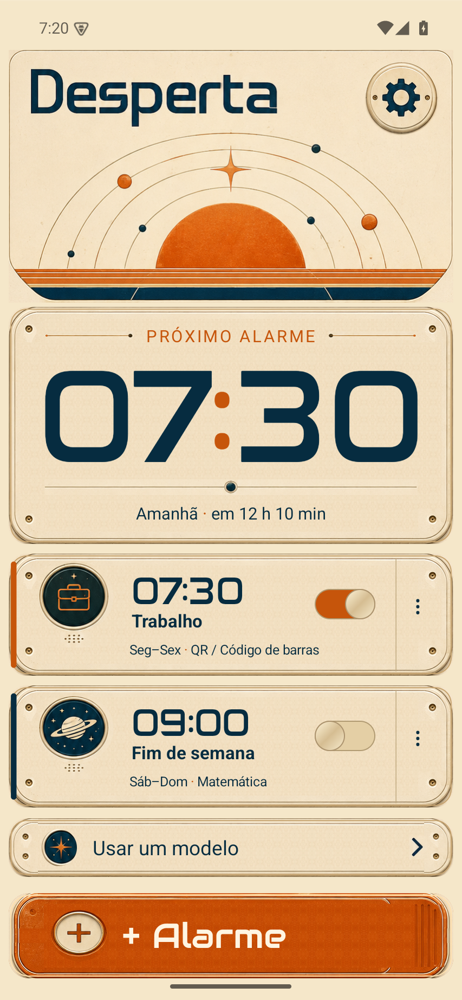
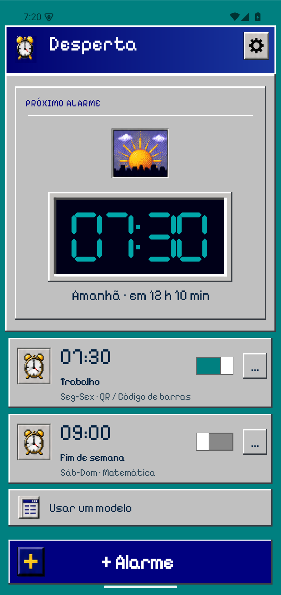
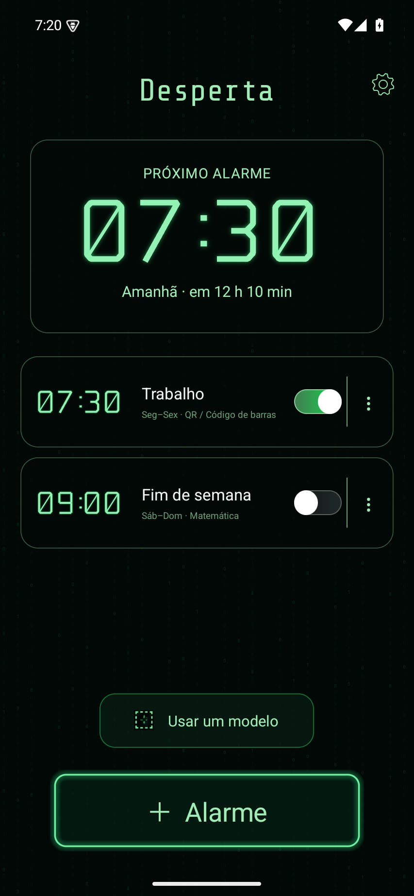
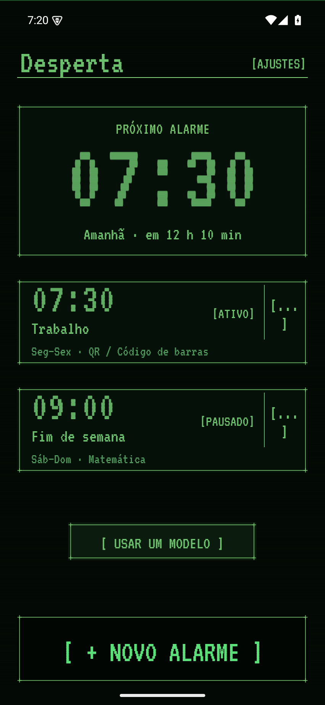

# Desperta

Despertador Android gratuito, sem anúncios e sem login. Quatro identidades visuais, Retrofuturista como padrão e interface em português com alarmes recorrentes e até cinco missões para despertar. Android 8.0 ou superior.

## Download

**[Baixar APK assinado](https://github.com/g0dswer/Desperta/releases/download/v1.3.0/Desperta-1.3.0.apk)** · [Notas da versão](https://github.com/g0dswer/Desperta/releases/tag/v1.3.0).

Esta versão foi validada em emulador. Testes físicos de sensores, voz, Bluetooth e reconhecimento visual ainda estão pendentes; consulte a matriz de cobertura. Abra o APK no Android e autorize a instalação pelo navegador/gerenciador de arquivos. Em **Ajustes → Otimização do alarme**, confira alarmes exatos, notificações, tela cheia e bateria antes do primeiro uso.

## Usar

1. Toque em **+ Alarme**, escolha horas e minutos nas colunas de rolagem e selecione os dias. Toque no nome para alterá-lo.
2. Abra **Como desligar** para escolher até cinco missões. Cada missão tem uma explicação, configuração e opção de experimentar. Você pode reordenar as missões pelo menu individual.
3. Em **QR / Código de barras**, configure a biblioteca: adicione códigos pela câmera, marque os aceitos, revise/exclua pelo menu e use **Testar leitura**. Qualquer código selecionado conclui essa missão.
4. Abra as seções **Som**, **Soneca**, **Voz** e **Aparência** para personalizar. Toque em **Salvar alarme**.
5. Toque no cartão para editar ou no menu para testar, pular uma ocorrência, alterar **Só na próxima vez**, duplicar, salvar modelo ou excluir. As ações de pular/excluir oferecem **Desfazer**.
6. Ao tocar, conclua as missões. Um código diferente mantém o leitor aberto e o alarme ativo. A prévia tem saída própria e preserva a recorrência.
7. Em **Ajustes → Atualizações**, consulte o GitHub e baixe versões novas. O app confere o APK e abre o instalador do Android para sua confirmação. A consulta diária ocorre ao abrir o app e pode ser desativada.

Sono, Manhã e Relatório foram excluídos a pedido. Conta, assinaturas e anúncios foram substituídos por acesso gratuito a todas as opções.

## Desenvolvimento

Java 17, Android SDK 36 e Gradle Wrapper:

```sh
./gradlew :app:assembleDebug :app:testDebugUnitTest :app:lintDebug
./gradlew :app:connectedDebugAndroidTest
```

Configure `sdk.dir` em `local.properties` ou `ANDROID_HOME`. O APK de depuração fica em `app/build/outputs/apk/debug/`. A versão de release é assinada fora do repositório; a chave privada não é publicada.

Veja [testes da versão 1.3.0](docs/TESTES-1.3.0.md), [identidades e revisão cega](docs/IDENTIDADES-1.3.0.md), [funcionalidades e evidências](docs/FUNCIONALIDADES.md) e [escopo do redesenho](docs/REDESIGN-1.2.0.md) e [privacidade](docs/PRIVACIDADE.md). A matriz distingue testes executados de validações que exigem aparelho físico. Uma compilação bem-sucedida não significa que todos os sensores foram validados.

## Identidades

Em **Ajustes → Identidade**, escolha Retrofuturista, Anos 90, Matrix ou Terminal antigo. A escolha vale para as telas do aplicativo e é salva automaticamente.

Capturas reais da versão 1.3.0, na resolução das referências:

   

[Relatórios dos revisores e tratamento dos apontamentos](docs/evidence/1.3.0/blind-review/RESOLUCAO.md). As capturas são do aplicativo funcionando; os horários e alarmes são dados reais.
