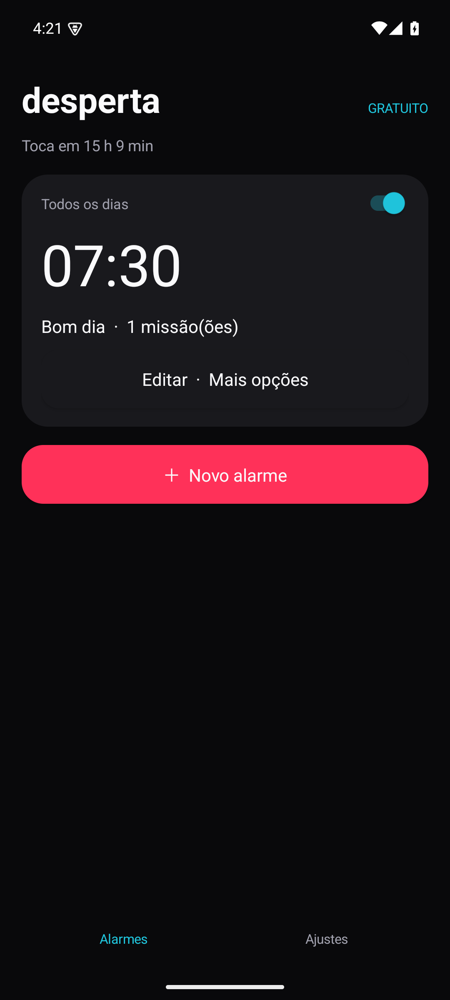
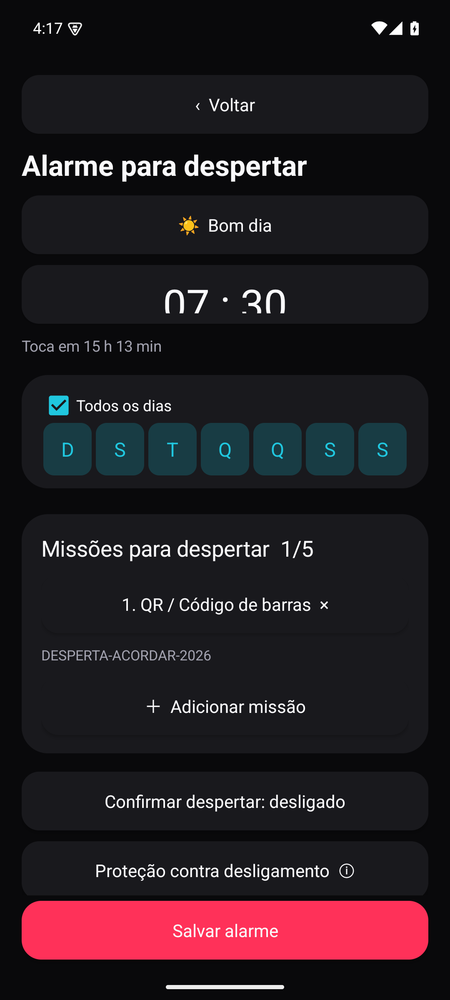

# Desperta

Despertador Android gratuito, sem anúncios e sem login. Interface em português com alarmes recorrentes e até cinco missões para despertar. Android 8.0 ou superior.

## Download

**[Baixar APK assinado](https://github.com/g0dswer/Desperta/releases/download/v1.0.0/Desperta-1.0.0.apk)** · [Notas da versão](https://github.com/g0dswer/Desperta/releases/tag/v1.0.0).

Esta versão foi validada em emulador. Testes físicos de sensores, voz, Bluetooth e reconhecimento visual ainda estão pendentes; consulte a matriz de cobertura. Abra o APK no Android e autorize a instalação pelo navegador/gerenciador de arquivos. Em **Ajustes → Otimização do alarme**, confira alarmes exatos, notificações, tela cheia e bateria antes do primeiro uso.

## Usar

1. Toque em **Novo alarme**, escolha horário, dias e nome.
2. Adicione até cinco missões. Em **QR / Código de barras**, escaneie o código que ficará no local onde deseja acordar.
3. Escolha som, volume, vibração, despertar gradual, voz, soneca e papel de parede; salve.
4. Use **Mais opções → Prévia do alarme** para experimentar. A prévia possui saída própria e não altera a recorrência.
5. No disparo real, conclua as missões em sequência. O código precisa corresponder ao cadastrado; cancelar a câmera ou apresentar outro código não encerra o alarme.

Sono, Manhã e Relatório foram excluídos a pedido. Conta, assinaturas e anúncios foram substituídos por acesso gratuito a todas as opções.

## Desenvolvimento

Java 17, Android SDK 36 e Gradle Wrapper:

```sh
./gradlew :app:assembleDebug :app:testDebugUnitTest :app:lintDebug
./gradlew :app:connectedDebugAndroidTest
```

Configure `sdk.dir` em `local.properties` ou `ANDROID_HOME`. O APK de depuração fica em `app/build/outputs/apk/debug/`. A versão de release é assinada fora do repositório; a chave privada não é publicada.

Veja [funcionalidades e evidências](docs/FUNCIONALIDADES.md) e [privacidade](docs/PRIVACIDADE.md). A matriz distingue testes executados de validações que exigem aparelho físico. Uma compilação bem-sucedida não significa que todos os sensores foram validados.

## Capturas

Capturas reais do app no emulador: [Alarmes](docs/screenshots/01-alarmes.png) · [Editor](docs/screenshots/02-editor.png) · [Som](docs/screenshots/03-som.png) · [Prévia](docs/screenshots/04-alarme.png) · [Ajustes](docs/screenshots/05-ajustes.png).

 
